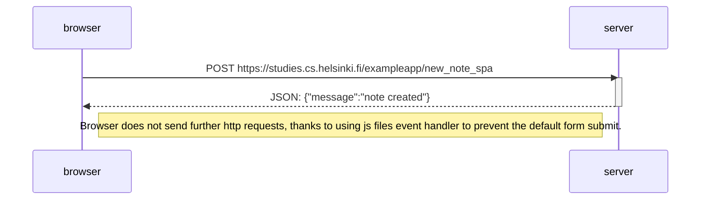

```mermaid
sequenceDiagram
    participant browser
    participant server

    browser->>server: POST https://studies.cs.helsinki.fi/exampleapp/new_note_spa
    activate server
    server-->>browser: JSON: {"message":"note created"}
    deactivate server

    Note right of browser: Browser does not send further http requests, thanks to using js files event handler to prevent the default form submit. 
```
